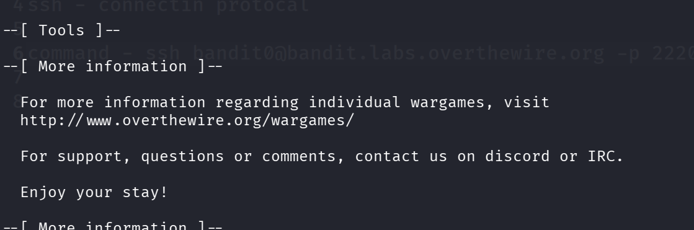

# Bandit

## Level 0

> commands
 login ssh - ssh bandit0@bandit.labs.overthewire.org -p 2220

- it will ask for password - "bandit0"

- now it will login to bandit0 user - now we have to find bandit 1 password here

## Level 0-1

> commands

- ls - to view the list of files in side a dirrectory /folder
- After ls you will find the Readme file
- cat - to read the file without opening it.
- cat Readme

password bandit1 - ZjLjTmM6FvvyRnrb2rfNWOZOTa6ip5If

## Level 1-2

>commands
- ls
- cat ./-
- 
- pssword bandit1 -  263JGJPfgU6LtdEvgfWU1XP5yac29mFx
## Level 2 → Level 3
>command
-ls
- cat -- "--spaces in this filename--"
- 
- pssword bandit2 -  MNk8KNH3Usiio41PRUEoDFPqfxLPlSmx
## Level 3 → Level 4
>command
- ls
- inhere
- ls -la
- cat ...Hiding-From-You
- 2WmrDFRmJIq3IPxneAaMGhap0pFhF3NJ
- 
- 
## Level 4 → Level 5
>command
- ls
- inhere
- cd inhere
- ls
- file ./*
- cat ./-file07
- 4oQYVPkxZOOEOO5pTW81FB8j8lxXGUQw
- 
-
## Level 5 → Level 6
>command
- ls
- inhere
- cd inhere
- du ./ -ab |grep 1033
- cat ./maybehere07/.file2
- HWasnPhtq9AVKe0dmk45nxy20cvUa6EG
- 
- 

## Level 6 → Level 7
>command
-pwd
-find / -user bandit7 -group bandit6 -size 33c 2>/dev/null
-/var/lib/dpkg/info/bandit7.password
-cat /var/lib/dpkg/info/bandit7.password
- morbNTDkSW6jIlUc0ymOdMaLnOlFVAaj
- 
- 

## Level 7 → Level 8
>command
-ls
-cat data.txt | grep millionth
- cat data.txt | wc -l
- dfwvzFQi4mU0wfNbFOe9RoWskMLg7eEc
 
- 

## Level 8 → Level 9
- cat data.txt | wc -l
- cat data.txt | sort |uniq | wc -l
- cat data.txt | sort |uniq -u | wc -l
- cat data.txt | sort |uniq -u
- 4CKMh1JI91bUIZZPXDqGanal4xvAg0JM

- 
- 

## Level 9 → Level 10
- ls
- data.txt
- strings data.txt | grep ==
- FGUW5ilLVJrxX9kMYMmlN4MgbpfMiqey

- 

## Level 10 → Level 11
-ls
-data.txt
-strings data.txt
- strings data.txt | grep "="
- FGUW5ilLVJrxX9kMYMmlN4MgbpfMiqey

-

## Level 11 → Level 12
-ls
-data.txt
-cat data.txt
- base64 -d data.txt
- dtR173fZKb0RRsDFSGsg2RWnpNVj3qRr

- 

## Level 12 → Level 13

-ls
-data.txt
-cat data.txt
-cat data.txt | tr 'A-Za-z' 'N-ZA-Mn-za-m'
- 7x16WNeHIi5YkIhWsfFIqoognUTyj9Q4

- 

## Level 13 → Level 14

